<div align="center">


# **Git+ Coach**

Git+ Coach is a free education app designed to help users learn Git and its commands. With an easy-to-use interface and smooth animations, the app provides an enjoyable user experience without any ads to distract from the learning process.

<br/>

<a href="https://t.me/gitcoach/"></a>


<br/>
<br/>
<br/>

<a href='https://apt.izzysoft.de/fdroid/index/apk/com.vishal2376.gitcoach'></a>
<a href='https://github.com/vishal2376/git-coach/releases/latest'></a>

</div>

## Features
- Browse through different categories of Git commands
- Test your Git knowledge with Quiz
- Search for any Git command
- Font Size Customization
- Copy Git command on single tap
- Clear explanations and examples of each command
- Smooth animations for a great user experience
- Cool Themes: Blue,Green, Red, and Yellow
- No ADS or In-App Subscription
- Support 8 Languages (English,Chinese,German,Italian,Portuguese,Russian,Spanish,Turkish)

## Screenshots

| 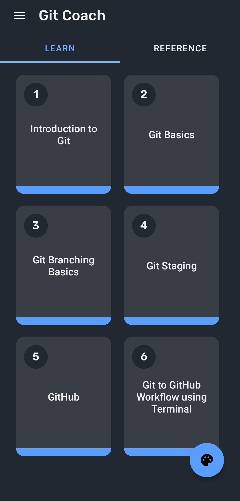 | 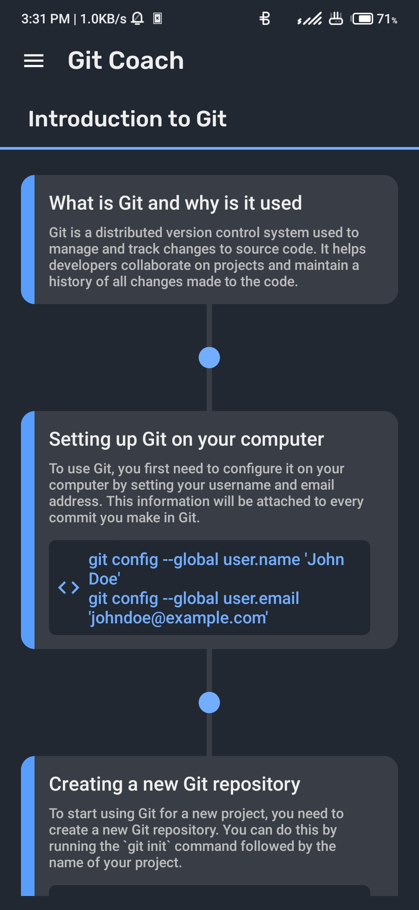 | 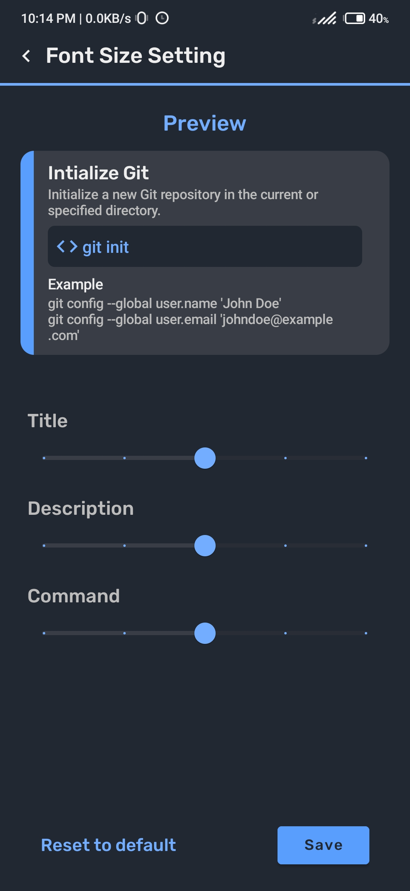 | 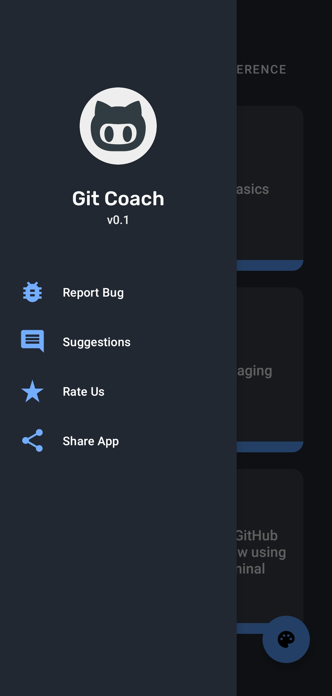 |
|---|---|---|---|
| 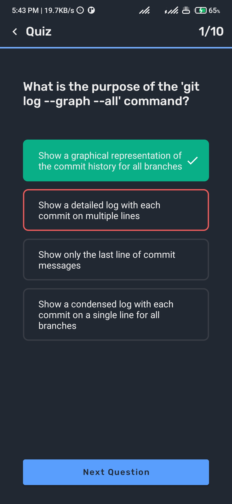 | 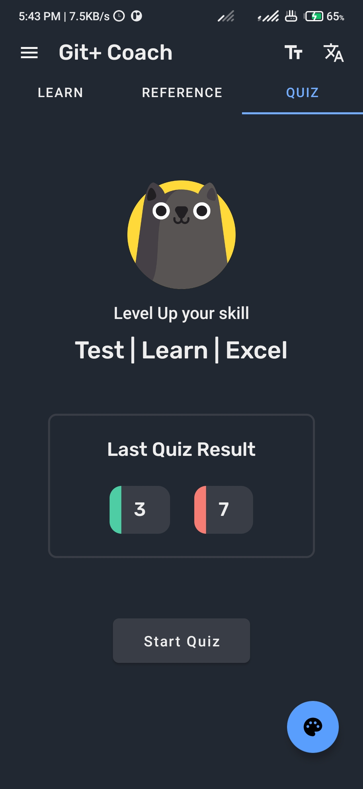 | 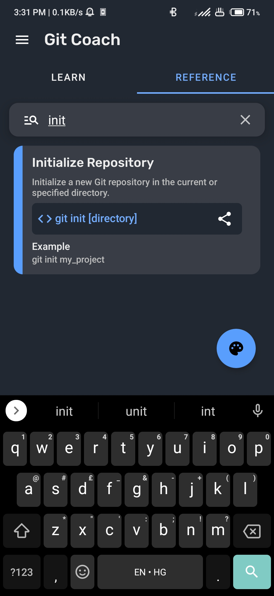 | 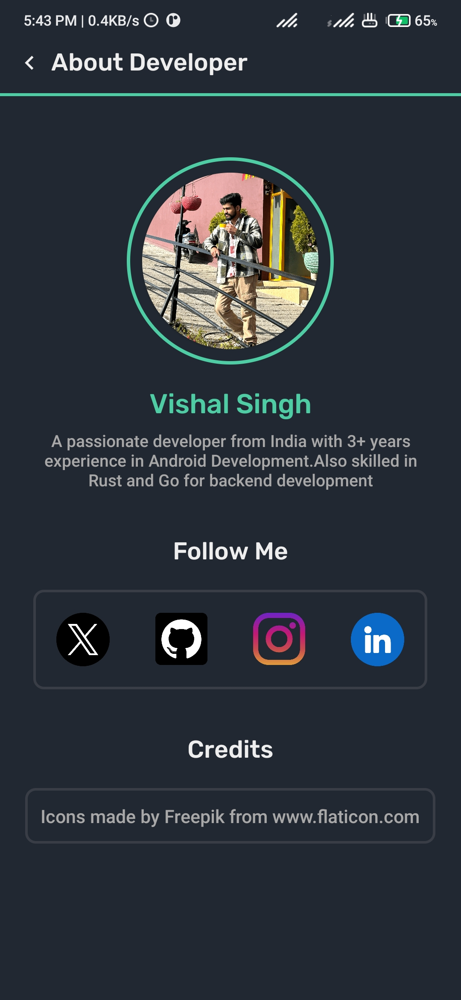 |
| 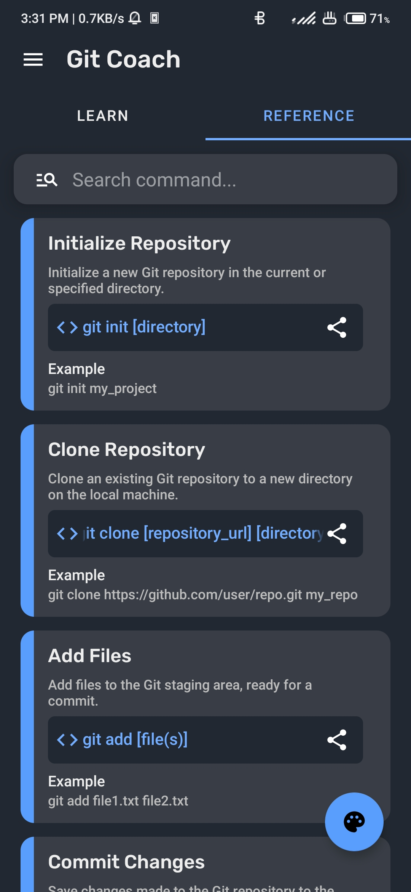 |  | 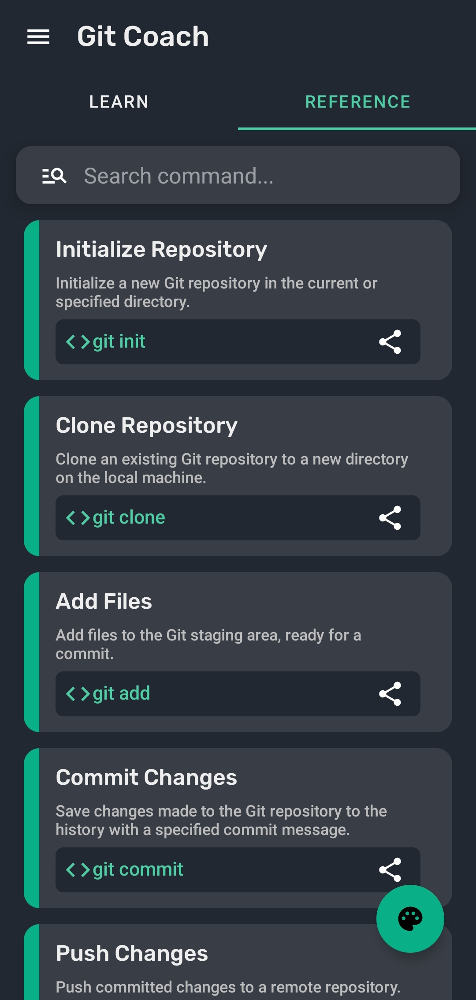 | 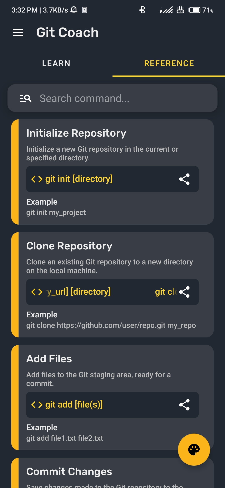 |

## Getting Started

To get started with Git+ Coach, simply download the app from the Google Play Store or download the source code and build it yourself.

### Prerequisites

- Android Studio
- Git

### Installing

1. Clone the repository
``` git clone https://github.com/vishal2376/git-coach.git ```
2. Open the project in Android Studio
3. Build and run the app

## Contributing

We welcome contributions from anyone interested in helping to improve Git+ Coach! Feel free to submit a pull request or open an issue if you notice any bugs or have suggestions for new features.


## Star History

[](https://star-history.com/#vishal2376/git-coach&Timeline)

## License

This project is licensed under the GPL v3.0 License - see the [LICENSE](LICENSE) file for details.

## Credits

App Icon made by Freepik from www.flaticon.com
